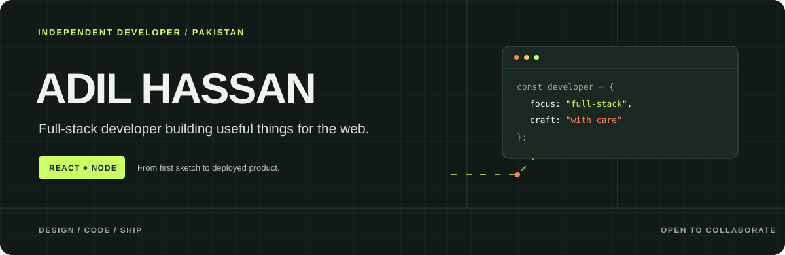
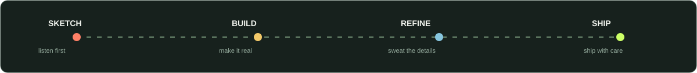
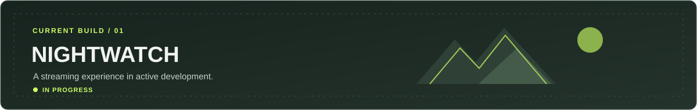
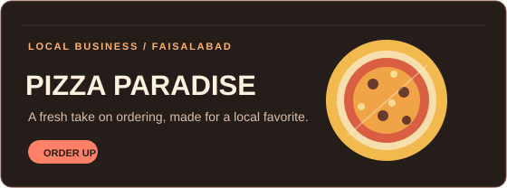
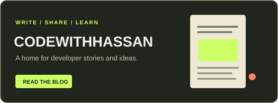
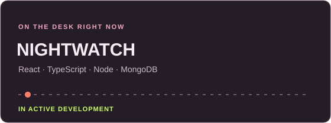

  
   
  
  
  

 

  

## I build things for the web.

I'm Adil, a self-taught full-stack developer from Punjab, Pakistan. For around two years, I've been taking ideas from first sketch to deployed product, with a soft spot for thoughtful interfaces and dependable backends.

  

 

  

 

  

## Selected work

  

<table>
  <tr>
    <td width="50%" valign="top">
      
       
      Ordering experience for a local business in Faisalabad. 
      React · Node.js · Supabase
    </td>
    <td width="50%" valign="top">
      
       
      Project filtering with lively interface animations. 
      HTML · CSS · JavaScript
    </td>
  </tr>
  <tr>
    <td width="50%" valign="top">
      
       
      A MERN-stack blog and developer content platform. 
      React · Node.js · MongoDB
    </td>
    <td width="50%" valign="top">
      
      <strong>Currently in the workshop</strong> 
      Building NightWatch; learning C++ DSA, Oracle SQL, and TypeScript. 
      Open to freelance projects
    </td>
  </tr>
</table>

 

  
  
  

